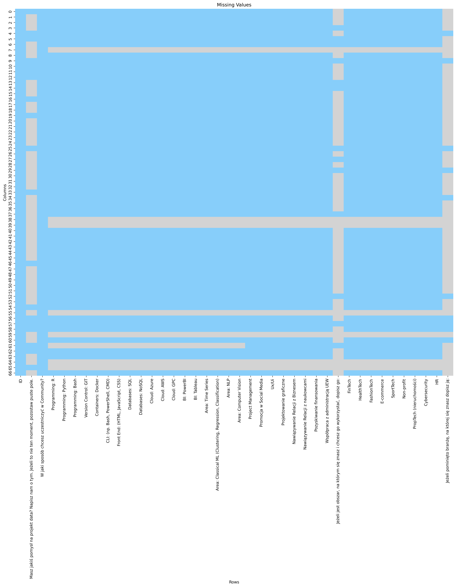
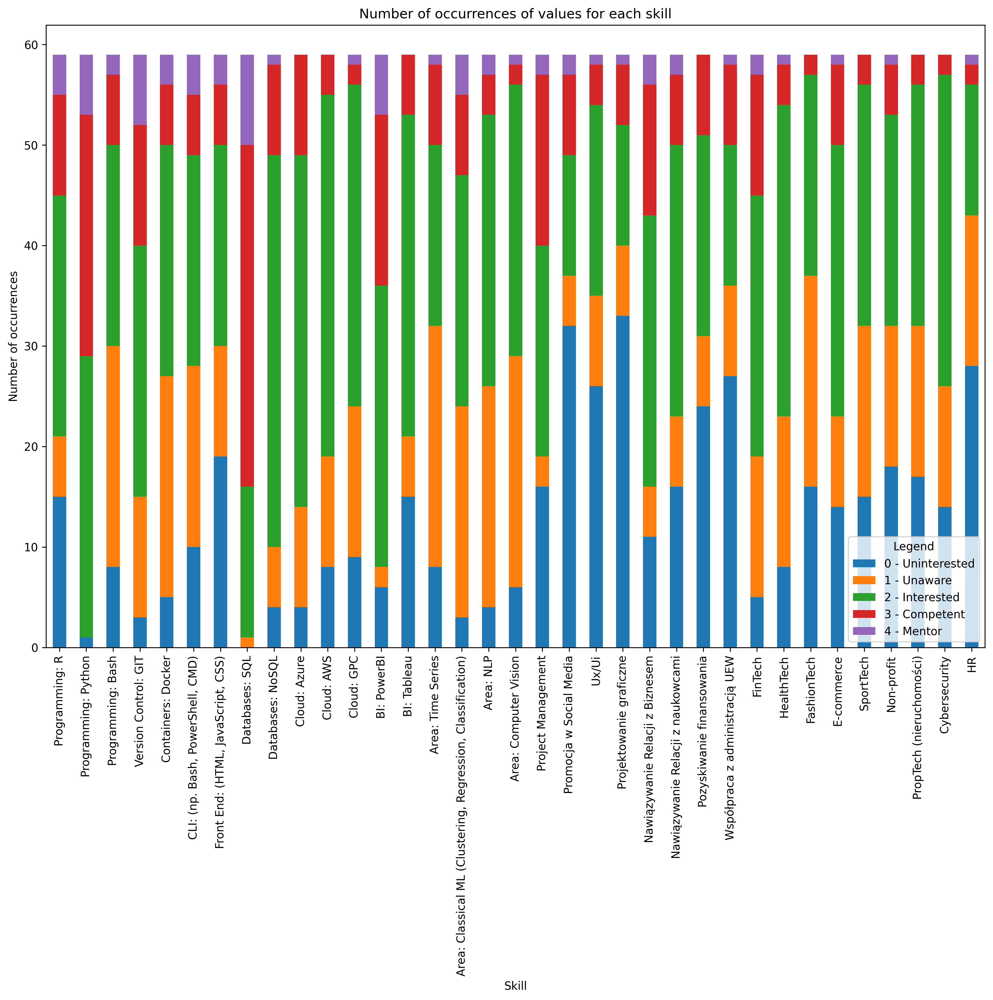
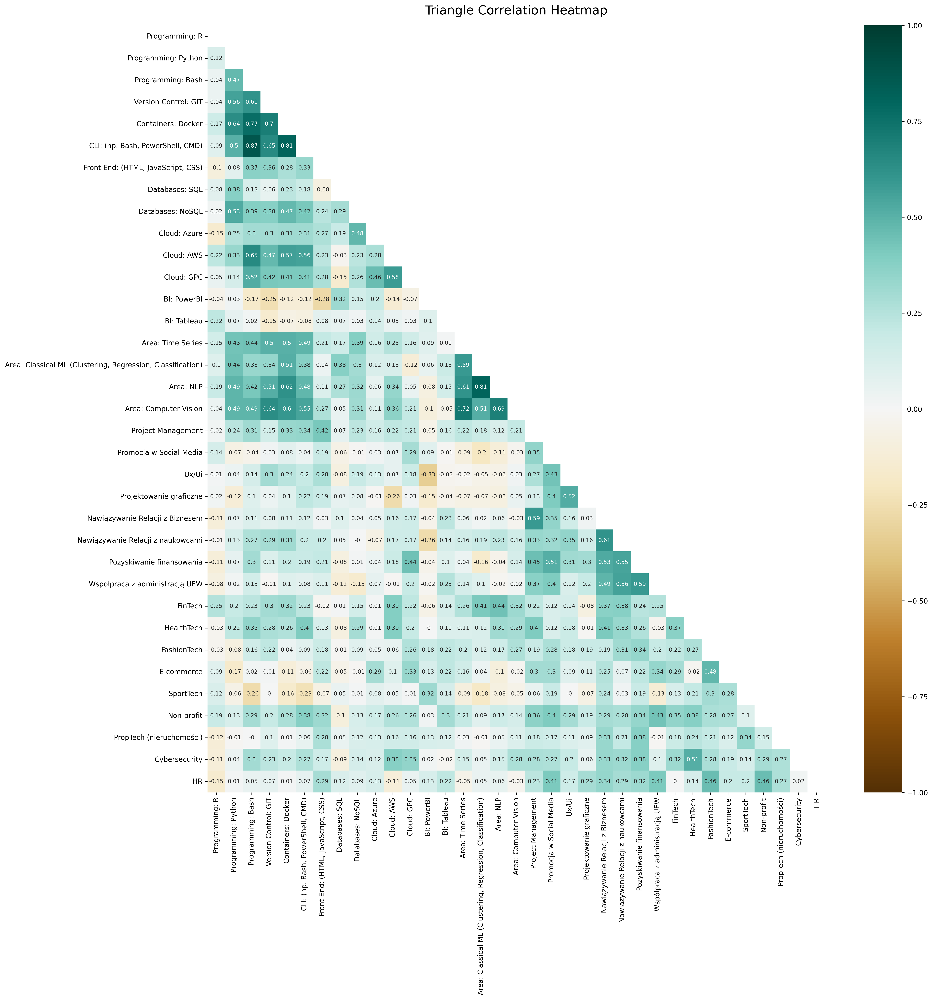

# Project People Analytics

## Project description
The project was initiated as a coursework assignment in a Data Mining class. Its purpose is to develop our skills in the field of artificial intelligence, with a particular focus on machine learning, teamwork, and using the GitHub platform. The data for the project was collected through a survey about the competencies of the members of the WAIT – Wrocław AI Team. 

## Business context
The aim of this project is to develop an algorithm that will enable the most accurate grouping of people based on their qualifications. This algorithm will then be used to identify individuals who are best suited to the requirements of a given project, thereby optimizing the process of creating project teams.

## Problem to be solved
The project aims to simplify the process of finding the most qualified individuals for appropriate roles in project teams. This qualification is supposed to be based on the algorithm we created and trained. 

## Machine Learning Method
The algorithm will use a machine learning method called clustering. This method involves grouping a set of objects in such a way that the objects belonging to the same group (cluster) are more similar to each other (according to specified criteria) than to objects in other groups (clusters).

## Our goal
The ultimate goal of this project is to be able to create simple and easy to read groups of our objects abilities. This will allow us to group people by advancment level and it will show us natural "circles" of "teachers" that want to or are able to share their knowledge and "students", which means people that want want to further hone and expand their skill repertoire.

## Our results

### Data preprocessing
We take our raw data to clean and preprare it for the analysis. 

#### Looking for missing values
First of all we are looking for incomplete data records. Some people cold miss a question or decided they do not want to answer it.

As You can see on the heatmap, we do have some records with missing values which are represented by the grey areas.

Our data is not in the perfect condition to analize it yet. So we need to prepare it some more. 

We managed to find our missing values but there are also some other values that we need to change and think through.

Just for stylistic purposes and clarity we are changing the name of the column from "W jaki sposób chcesz uczestniczyć w Community?" to "Participation". It will aloow us to have better visual of the data and it will make it easier to understand purpose of the data in the column.

After renaming it we are simplifying contents of the answers so it would be more consisent and understandable. Firts, we check what kind of unique answers are available and can be encountered.

#### Deleting data
To clean our data records even further we need to throw out "garbage". In this case this "garbage" would be ccolumns that hold answers to the open questions. Very few students decided to answer them so it just messies up our data set and could only confuse us.

To corecctly delete columns we use formlua below and we also specify which ones we want to "drop" by adressing them.

Our data can be considered "clean" now. As seen on the heatmap below there are no missing values.

This heatmap can be considered "clean" as all of the "grey areas" are deleted. We can move forward with our preparations. 

#### Changing values
Now we can change values to make our results more readable and understandable. We change our values from 0 to 1 to optimize and simplify our possible skill groups. People willing to learn new skill and those that already heard of this particular skill will be grouped as a single case.

Upon further deliberation and our analysis we decided to drop some more columns this time the ones which names could be deemed confusing for the students that answered them. We do this so we can avoid clusers that are untrue and do not reflect reality too well.

### Exploratory Data Analysis

#### Skill measurment
Firstly, we check how points distribute amogst the skill types. Our legend on the visualization clearly states which colour belongs to which level of familarity with the skill. 

We can clearly see the ratio between "mentors" and "interested" students in certain skills.

#### Correlation matrix
To check correlation within our data we create a correlation matrix. FOr cleanles of our documentation we decided to create a triangle type of this specific matrix. Thanks to that we can see which skills have the strongest corellation.

As we can clearly see, the correlation in our data set is incredibly weak, except for a few pairs of skills.

### Hierarchical analysis
One of the methods of analysis and gropuing we are using to create clusters is hierachical analisis. It allows us to visualize a specific groups in a tree or tree-root form. Additionally, we can see potential clusters from the beginning.
To be able to generate correct dendrograms we are setting ID as an index for the generated dendrograms.

#### Data with Industry Knowledge
Our first experiment consists of data with industry knowledge.

We are also experimenting a bit with different distances like "Manhattan" and "Euclidean".

The Euclidean and Manhattan distance matrix for the data were calculated, which will be used for clustering. We perform hierarchical clustering using Ward's method, which minimizes the sum of squared distances within clusters.

##### Euclidean Distance
The first dendrogram that we will generate to check its clusters is dependant on euclidean distance.

Next, we are generate a plot of bonding distances versus bonding stages (scree plot) to help determine the appropriate dendrogram cutting threshold.

Based on the scree plot, we choose the threshold at level 12.

##### Manhattan Distance
Secondly, we are testing the manhattan distance.

Then, we are generate a plot of bonding distances versus bonding stages (scree plot) to help determine the appropriate dendrogram cutting threshold.

Based on the screen plot, we choose the threshold at level 58.

##### Differences
As we can see both distances generate different dendrograms. This brigns us to the next step to create clusters and assign ID to the them.

##### Clustering
Firstly, we need to determine cut-off point in both dendrograms. This will allow us to determine number o clusters for each of distances.

Those are our results
 - Number of clusters (Euclidean distance): 6
 - Number of clusters (Manhattan distance): 7

##### Cluster members
Now knowing the number of clusters, we can assign members to each of them for both distances.

Here are our groups
Assignment of objects to clusters (Euclidean distance):
Klaster 1: [2, 4, 5, 6, 10, 13, 21, 24, 25, 29, 30, 32, 49]
Klaster 2: [1, 17, 63]
Klaster 3: [31, 51, 59]
Klaster 4: [3, 23, 36, 44]
Klaster 5: [7, 11, 12, 15, 18, 26, 27, 33, 37, 38, 41, 42, 45, 47, 48, 55, 57, 64]
Klaster 6: [9, 14, 16, 19, 20, 22, 28, 34, 35, 43, 46, 50, 52, 53, 54, 58, 61, 67]

Assignment of objects to clusters (Manhattan distance):
Klaster 1: [3, 9, 14, 16, 18, 19, 22, 37, 43, 52, 54, 57, 61]
Klaster 2: [7, 11, 15, 20, 26, 27, 33, 35, 42, 46, 48, 50, 53, 55, 58, 67]
Klaster 3: [12, 23, 36, 38, 41, 44, 45, 47, 64]
Klaster 4: [31, 34, 51]
Klaster 5: [5, 59]
Klaster 6: [1, 17, 63]
Klaster 7: [2, 4, 6, 10, 13, 21, 24, 25, 28, 29, 30, 32, 49]

#### Data without industry knowledge
This time we are using our second data set, the one without industrial knowledge. 

The Euclidean and Manhattan distance matrix for the data were calculated, which will be used for clustering. We perform hierarchical clustering using Ward's method, which minimizes the sum of squared distances within clusters.

##### Euclidean Distance
Our steps are excaly the same as with the first data set.

Next, we are generate a plot of bonding distances versus bonding stages (scree plot) to help determine the appropriate dendrogram cutting threshold.

Based on the screen plot, we choose the threshold at level 11.

##### Manhattan Distance
Secondly, we are testing the manhattan distance.

Then, we are generate a plot of bonding distances versus bonding stages (scree plot) to help determine the appropriate dendrogram cutting threshold.

Based on the screen plot, we choose the threshold at level 45.

##### Number of clusters
Thank to this formula we learn how many clusters we created for each distance for data with industrial knowledge.

Our number of clusters for both distances is the same with this data set. 

Number of clusters (Euclidean distance): 6
Number of clusters (Manhattan distance): 6

##### Cluster members
Now knowing the number of clusters, we can assign members to each of them for both distances.

Assignment of objects to clusters (Euclidean distance):
Klaster 1: [1, 17, 31, 51, 59]
Klaster 2: [4, 5, 6, 10, 13, 21, 24, 29, 30, 32, 33, 38, 43, 45, 63]
Klaster 3: [23, 36, 44]
Klaster 4: [3, 11, 12, 14, 18, 26, 27, 37, 41, 47, 55, 57, 61, 64]
Klaster 5: [19, 25, 28, 34, 49]
Klaster 6: [2, 7, 9, 15, 16, 20, 22, 35, 42, 46, 48, 50, 52, 53, 54, 58, 67]

Assignment of objects to clusters (Manhattan distance):
Klaster 1: [1, 17, 31, 51, 59, 63]
Klaster 2: [19, 25, 28, 34]
Klaster 3: [4, 5, 6, 10, 13, 21, 24, 29, 30, 32, 33, 45, 49]
Klaster 4: [3, 12, 23, 36, 38, 41, 44, 47, 64]
Klaster 5: [2, 20, 26, 35, 43, 50, 53, 55, 61, 67]
Klaster 6: [7, 9, 11, 14, 15, 16, 18, 22, 27, 37, 42, 46, 48, 52, 54, 57, 58]

#### Conclusion for hierarchical analysis
Based on our hierarchical analysis, we can conclude that the dataset without industry knowledge provides better-distributed clusters. The results including industry knowledge were distorted, leading to less effective clustering. By excluding industry knowledge data, we obtain clusters that group together similar objects more effectively. We chose the Manhattan distance for our hierarchical analysis because it provides better-defined clusters. Manhattan distance is considered the most effective metric in this context as it evenly distributes the data points across the clusters. This results in clusters that are not only distinct but also balanced, ensuring that no single cluster is disproportionately large or small.

By using the Manhattan distance and Ward's method, we achieved a clustering that respects the inherent variability in the data, resulting in more distinct and meaningful clusters. This approach allows us to evenly distribute students among the clusters, ensuring balanced and fair grouping. The hierarchical clustering with Manhattan distance effectively captures the essential structure of the dataset, leading to practical and actionable insights.

### K-means Clustering
K-means is a clustering algorithm used to partition a dataset into 𝑘 distinct, non-overlapping subsets or clusters. It aims to minimize the within-cluster sum of squares (also known as inertia)

#### How algorithm works
Initialization:
* Choose the number of clusters 𝑘
* Initialize 𝑘 centroids randomly. These can be randomly chosen points from the dataset or generated randomly within the range of the data

Assignment:
* Assign each data point to the nearest centroid. This is typically done using the Euclidean distance, though other distance metrics can be used
* The result is 𝑘 clusters, where each point belongs to the cluster with the nearest centroid

Update:
* Recalculate the centroids of each cluster. The new centroid is the mean of all the points assigned to that cluster

Convergence check:
* Repeat the assignment and update steps until the centroids no longer change significantly or until a maximum number of iterations is reached
* Convergence is typically defined as the point at which the assignment of points to clusters no longer changes, or the changes are minimal

#### Optimise_k_means function
The optimise_k_means function is designed to help determine the optimal number of clusters 𝑘 using the "elbow method".

#### K-means using data with industry knowledge

##### Creation of instance of K-means with parameters:
* n_clusters, which means on how many pieces algorithm will partition data
* random_state, which is used to seed the random number generator, which is used by algorithm to ensure that the results are reproducible

##### kmeans.fit()
kmeans.fit(data_mapped) fits the K-means clustering model to the dataset. It involves initializing cluster centroids, assigning data points to clusters, recalculating centroids, and iterating these steps until convergence.

##### kmeans.labels_
data_mapped['kmeans_6'] = kmeans.labels_ is assigning the cluster labels generated by the K-means algorithm to a new column in the data_mapped

Assignment of objects to clusters:
Klaster 1: [19, 25, 28, 34, 58]
Klaster 2: [3, 7, 9, 11, 12, 14, 15, 16, 18, 20, 22, 23, 26, 27, 35, 37, 41, 42, 43, 46, 47, 48, 50, 52, 53, 54, 55, 57, 61, 64, 67]
Klaster 3: [2, 4, 24, 29, 32, 36, 44]
Klaster 4: [5, 6, 10, 13, 21, 30, 33, 38, 45, 49]
Klaster 5: [1, 17, 63]
Klaster 6: [31, 51, 59]

#### K-means using data without industry knowledge
The steps that were used previously will be used accordingly, but with slightly different data set.

##### kmeans.labels_
data_mapped['kmeans_6'] = kmeans.labels_ is assigning the cluster labels generated by the K-means algorithm to a new column in the data_mapped

Assignment of objects to clusters:
Klaster 1: [19, 25, 28, 34]
Klaster 2: [5, 6, 10, 13, 21, 26, 30, 32, 33, 43, 49, 57]
Klaster 3: [7, 9, 11, 14, 15, 16, 20, 22, 27, 35, 37, 42, 46, 48, 50, 52, 53, 54, 55, 58, 61, 67]
Klaster 4: [3, 12, 18, 23, 36, 41, 44, 47, 64]
Klaster 5: [1, 2, 4, 24, 29, 38, 45, 63]
Klaster 6: [17, 31, 51, 59]

#### Conclusion
After the analysis, we can conclude that better results are produced by using data without industry knowledge. Industry knowledge badly influence members inside clusters, because of misconception of questions connected with them inside survey. By leaving out industry-specific knowledge, we achieve clusters that more efficiently group similar objects together. 
We used Lloyd's algorithm for our k-means clustering. Lloyd's algorithm iteratively refines cluster centers by alternating between assigning each data point to the nearest cluster center and then updating the cluster centers based on the mean of the assigned points. This process continues until convergence, ensuring an effective grouping of similar data points.

#### Our requirements
[Check it out here!](../docs//Requirements.md)